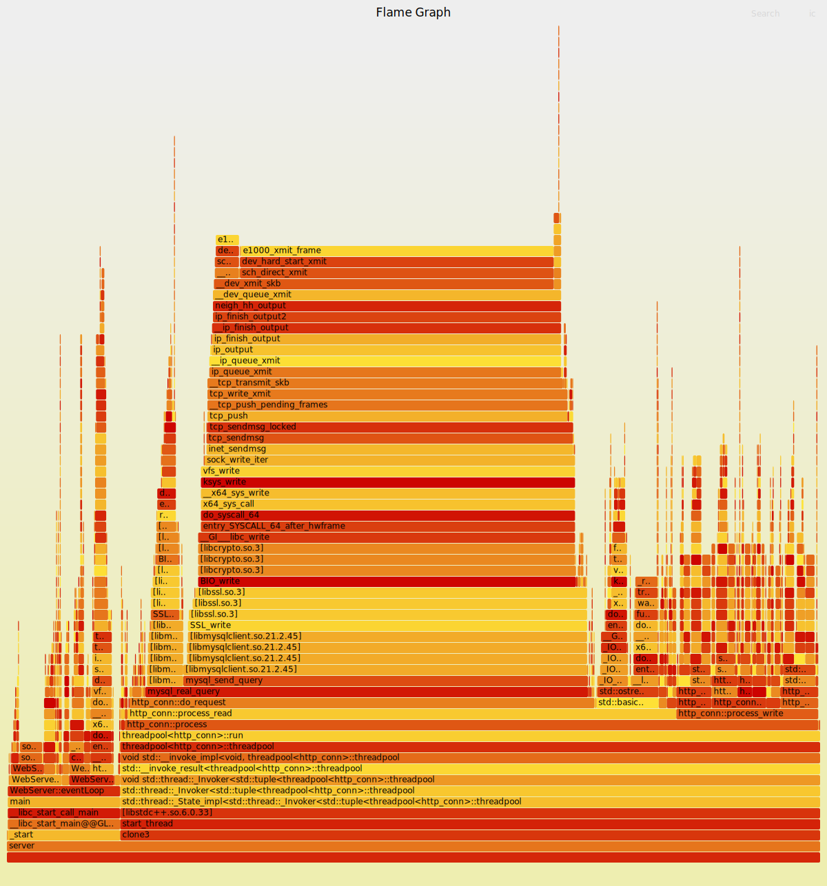

# Linux 下高并发 Web 服务器

* 使用 **epoll(LT)** 的模拟 Proactor 并发模型
* 使用**状态机**解析HTTP请求报文，支持解析**GET**和**POST**请求
* 实现**同步/异步日志系统**，记录服务器运行状态
* 经 Goroutine 压力测试，在 10000 并发连接下，可以达到 **8000QPS**

## 框架

<div align=center> </div>

## 快速运行

* 服务器环境
	* Ubuntu 24.04
	* MySQL 8.4

## 启动server

```bash
./server
```

## 压力测试

使用 Goroutine 对服务器进行压力测试，可实现上万的并发连接

```bash
go run pressureTest.go -c 10000 -t 60 -url http://localhost:9006
```

> * 并发连接总数：10000
> * 访问服务器时间：60s
> * 所有 POST 均成功

## TCP 状态检查

```bash
sudo netstat -anp | grep :9006 | awk '{print $6}' | sort | uniq -c
```

## perf Flamegraph 分析

```bash
sudo perf record -F 99 -a -p <PID> -g -- sleep 10
sudo perf script > perf.perf
./stackcollapse-perf.pl perf.perf > perf.folded
./flamegraph.pl perf.folded > perf.svg
```



## 庖丁解牛

* [一文读懂TinyWebServer](https://huixxi.github.io/2020/06/02/%E5%B0%8F%E7%99%BD%E8%A7%86%E8%A7%92%EF%BC%9A%E4%B8%80%E6%96%87%E8%AF%BB%E6%87%82%E7%A4%BE%E9%95%BF%E7%9A%84TinyWebServer/#more)
* [01 线程同步机制封装类](https://mp.weixin.qq.com/s?__biz=MzAxNzU2MzcwMw==&mid=2649274278&idx=3&sn=5840ff698e3f963c7855d702e842ec47&chksm=83ffbefeb48837e86fed9754986bca6db364a6fe2e2923549a378e8e5dec6e3cf732cdb198e2&scene=0&xtrack=1#rd)
* [02 半同步半反应堆线程池（上）](https://mp.weixin.qq.com/s?__biz=MzAxNzU2MzcwMw==&mid=2649274278&idx=4&sn=caa323faf0c51d882453c0e0c6a62282&chksm=83ffbefeb48837e841a6dbff292217475d9075e91cbe14042ad6e55b87437dcd01e6d9219e7d&scene=0&xtrack=1#rd)
* [03 半同步半反应堆线程池（下）](https://mp.weixin.qq.com/s/PB8vMwi8sB4Jw3WzAKpWOQ)
* [04 http连接处理（上）](https://mp.weixin.qq.com/s/BfnNl-3jc_x5WPrWEJGdzQ)
* [05 http连接处理（中）](https://mp.weixin.qq.com/s/wAQHU-QZiRt1VACMZZjNlw)
* [06 http连接处理（下）](https://mp.weixin.qq.com/s/451xNaSFHxcxfKlPBV3OCg)
* [07 定时器处理非活动连接（上）](https://mp.weixin.qq.com/s/mmXLqh_NywhBXJvI45hchA)
* [08 定时器处理非活动连接（下）](https://mp.weixin.qq.com/s/fb_OUnlV1SGuOUdrGrzVgg)
* [09 日志系统（上）](https://mp.weixin.qq.com/s/IWAlPzVDkR2ZRI5iirEfCg)
* [10 日志系统（下）](https://mp.weixin.qq.com/s/f-ujwFyCe1LZa3EB561ehA)
* [11 数据库连接池](https://mp.weixin.qq.com/s?__biz=MzAxNzU2MzcwMw==&mid=2649274326&idx=1&sn=5af78e2bf6552c46ae9ab2aa22faf839&chksm=83ffbe8eb4883798c3abb82ddd124c8100a39ef41ab8d04abe42d344067d5e1ac1b0cac9d9a3&token=1450918099&lang=zh_CN#rd)
* [12 注册登录](https://mp.weixin.qq.com/s?__biz=MzAxNzU2MzcwMw==&mid=2649274431&idx=4&sn=7595a70f06a79cb7abaebcd939e0cbee&chksm=83ffb167b4883871ce110aeb23e04acf835ef41016517247263a2c3ab6f8e615607858127ea6&token=1686112912&lang=zh_CN#rd)
* [13 踩坑与面试题](https://mp.weixin.qq.com/s?__biz=MzAxNzU2MzcwMw==&mid=2649274431&idx=1&sn=2dd28c92f5d9704a57c001a3d2630b69&chksm=83ffb167b48838715810b27b8f8b9a576023ee5c08a8e5d91df5baf396732de51268d1bf2a4e&token=1686112912&lang=zh_CN#rd)
